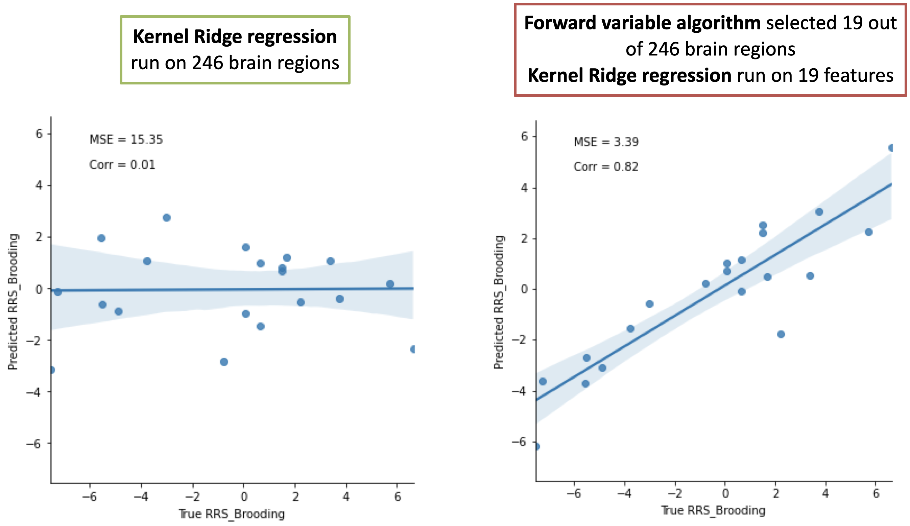
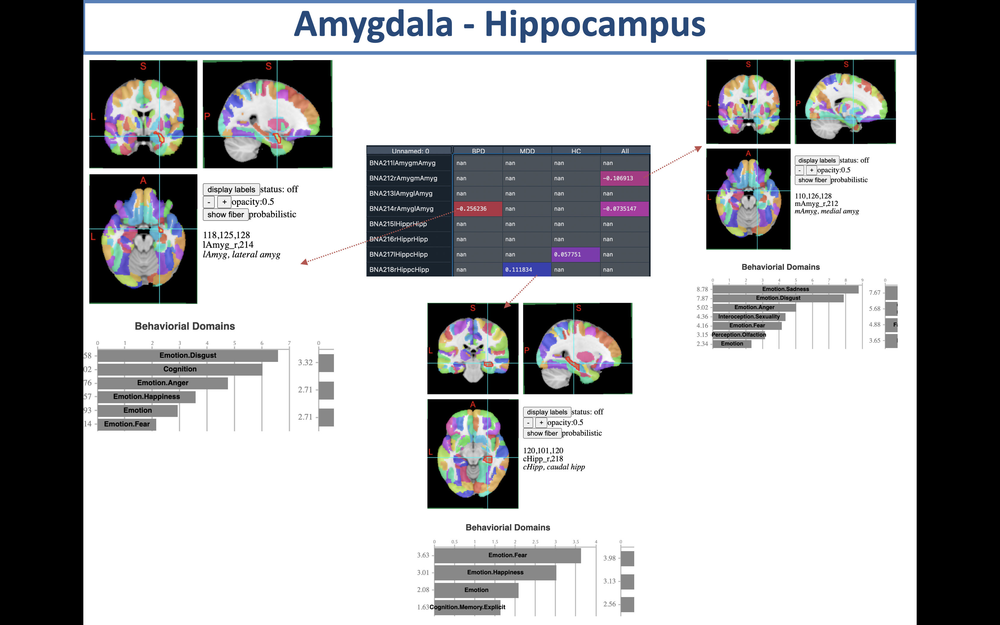
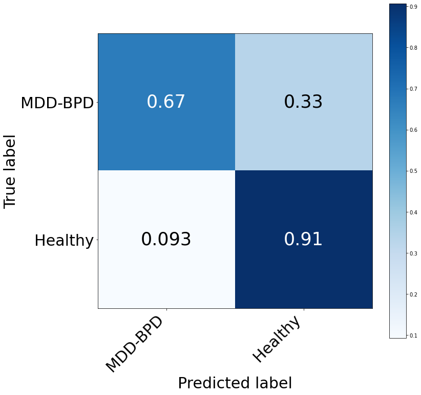

# AutoML_FVS: A new approach to identify a important group of brain region from fMRI databases 

## The workflow of the algorithm


## Main commands and options

### 1. Automatic machine learning approaches 
### 1.1 Regression

```
import pandas as pd
import numpy as np
import matplotlib.pyplot as plt
import seaborn as sns
from sklearn.model_selection import train_test_split
from Auto_ML_Regression import AutoML_Regression
```

Import data and run automatic machine learning algorithm 

```
ress_BPD_brain = pd.read_csv("BPD_brain.csv", header=None)
ress_BPD_meta = pd.read_csv("BPD_rrs.csv", header=None)
y = ress_BPD_meta["RRS_Brooding"]

X_train, X_test, y_train, y_test = train_test_split(ress_BPD_brain, y, test_size=0.3, random_state=42)

automl = AutoML_Regression()
result = automl.fit(X_train, y_train, X_test, y_test)

```
Outputs are shown in table 

| Rank |Name_Model                  | MSE       | MAE      | R2_Score |
|------|--------------------------- |:---------:|:--------:|:--------:|
|   1  |KernelRidge_regression      | 15.396256 | 3.192229 | 0.064702 |
|   2  |LassoLars_regression        | 15.589468 | 3.193472 | 0.052964 |
|   3  |MultiTaskLasso_regression   | 15.589468 | 3.193472 | 0.052964 |
|   4  |Ridge_regression            | 16.224041 | 3.228338 | 0.014415 |
|   5  |ElasticNet_regression       | 16.345417 | 3.239610 | 0.007041 |
|   6  |Lars_regression             | 16.396985 | 3.252711 | -0.01626 |
|   7  |eXtreme_Gradient_Boosting   | 16.729033 | 3.209346 | 0.003909 |
|   8  |GaussianProcess_regression  | 16.739256 | 3.310950 | -0.01684 |
|   9  |Stochastic_Gradient_Descent | 17.032267 | 3.353871 | -0.03468 |
|  10  |LASSO_regression            | 17.079694 | 3.252711 | -0.03756 |
|  11  |DecisionTree_regression     | 18.015736 | 3.422243 | -0.09442 |
|  12  |Random_Forest               | 18.892558 | 3.570010 | -0.14769 |

### 1.2 Classification

```
import pandas as pd
import numpy as np
import matplotlib.pyplot as plt
import seaborn as sns
from sklearn.model_selection import train_test_split
from Auto_ML_Multiclass import AutoML_classification
```

Import data and run automatic machine learning algorithm 

```
rumi = pd.read_csv("rumi.csv")
rumi_region = rumi.drop(columns = ['MRI_ordID', 'CurrentDepression', 'Depressiongroup', 'TIV',
       'Age', 'Gender_1_male', 'BDI_Total', 'RRS_Brooding', 'RRS_Reflection', 'RRS_DepressiveRumination',
       'RRS_Total', 'Dep_PastEpisodes', 'Dep_Duration'])
```

### 1.2.1 Binary 

```
y = rumi_meta["Depressiongroup"].apply(lambda x: 0 
                                          if x == "H" else 1)
class_name = ["MDD-BPD", 'Healthy']
X_train, X_test, y_train, y_test = train_test_split(rumi_region, y, test_size=0.3, random_state=42)

automl = AutoML_classification()
result = automl.fit(X_train, y_train, X_test, y_test)
```
Outputs are shown in table 

| Rank | Name_Model                  | Accuracy (%)| Precision | Recall   | F1_Score |
| -----|---------------------------- |:-----------:|:---------:|:--------:|:--------:|
|   1  | Random_Forest               | 61.842105   | 0.6103    | 0.5923   | 0.5869   |
|   2  | Extreme_Gradient_Boosting   | 60.115261   | 0.5903    | 0.5822   | 0.5614   |
|   3  | Support_Vector_Machine      | 59.210526   | 0.5783    | 0.5655   | 0.5584   |
|   4  | Gradient_Boosting           | 58.320126   | 0.5615    | 0.5691   | 0.5649   |
|   5  | Losgistic_Classification    | 56.578947   | 0.5535    | 0.5571   | 0.5579   |
|   6  | Naive_Bayes                 | 55.294832   | 0.5492    | 0.5387   | 0.5426   |
|   7  | Stochastic_Gradient_Descent | 52.631579   | 0.5213    | 0.5215   | 0.5210   |
|   8  | Decision_Tree               | 49.543053   | 0.4815    | 0.4943   | 0.4834   |
|   9  | Extra_Tree                  | 43.421053   | 0.4265    | 0.4260   | 0.4262   |

### 1.2.2 Multi-class 

```
y = rumi["Depressiongroup"].apply(lambda x: 0 
                                          if x == "MDD" else 1
                                          if x == "BPD" else 2)
class_name = ["MDD", "BPD", 'Healthy']
X_train, X_test, y_train, y_test = train_test_split(rumi_region, y, test_size=0.3, random_state=42)

automl = AutoML_classification()
result = automl.fit(X_train, y_train, X_test, y_test)
```
Outputs are shown in table 

| Rank | Name_Model                  | Accuracy (%)| Precision | Recall   | F1_Score |
| -----|---------------------------- |:-----------:|:---------:|:--------:|:--------:|
|   1  | Decision_Tree               | 45.105263   | 0.4523    | 0.4401   | 0.4536   |
|   2  | Extra_Tree                  | 42.235273   | 0.4200    | 0.4185   | 0.4194   |
|   3  | Random_Forest               | 39.526316   | 0.3915    | 0.3727   | 0.3876   |
|   4  | eXtreme_Gradient_Boosting   | 38.337316   | 0.3855    | 0.3647   | 0.3766   |
|   5  | Support_Vector_Machine      | 36.894737   | 0.3682    | 0.3427   | 0.3557   |
|   6  | Gradient_Boosting           | 35.526316   | 0.3515    | 0.3456   | 0.3386   |
|   7  | Stochastic_Gradient_Descent | 32.795747   | 0.3282    | 0.3227   | 0.3077   |
|   8  | Losgistic_Classification    | 31.526316   | 0.3115    | 0.3017   | 0.3178   |
|   9  | Naive_Bayes                 | 30.294832   | 0.3092    | 0.3087   | 0.3026   |

### 2. Forward variable selection algorithm
### 2.1 Regression

After selecting the best algorithm for analyzing our database, we go to the next step that run forward variable selection to identify a important group of brain regions. For example, in our database, the kernel ridge regression is the best model with the smallest value of MSE. Thus, we start with combination of the kernel ridge regression and forward variable selection. 

```
from FVS_algorithm import AutoML_FVS
fvs = AutoML_FVS()
all_info, all_model, f = fvs.KernelRidge_FVS(X_train, y_train, X_test, y_test, n_selected_features = 200)

[Parallel(n_jobs=-1)]: Using backend LokyBackend with 80 concurrent workers.
[Parallel(n_jobs=-1)]: Done  40 tasks      | elapsed:   38.9s
[Parallel(n_jobs=-1)]: Done 246 out of 246 | elapsed:  2.4min finished
The current number of features: 1 - MSE: 12.51

[Parallel(n_jobs=-1)]: Using backend LokyBackend with 80 concurrent workers.
[Parallel(n_jobs=-1)]: Done  40 tasks      | elapsed:   36.9s
[Parallel(n_jobs=-1)]: Done 246 out of 246 | elapsed:  2.4min finished
The current number of features: 2 - MSE: 10.48

[Parallel(n_jobs=-1)]: Using backend LokyBackend with 80 concurrent workers.
[Parallel(n_jobs=-1)]: Done  40 tasks      | elapsed:   41.4s
[Parallel(n_jobs=-1)]: Done 246 out of 246 | elapsed:  2.5min finished
The current number of features: 3 - MSE: 9.67

.....

```

### 2.2 Classification

After selecting the best algorithm for analyzing our database, we go to the next step that run forward variable selection to identify a important group of brain regions. For example, in our database, the decision tree classifier is the best model with the highest accuracy. Thus, we start with combination of the decision tree classifier and random forest classifier and forward variable selection. 

### 2.2.1 Binary

#### Random forest classifier

```
all_info, all_model, f = fvs.RandomForest_FVS(X_train, y_train, X_test, y_test, n_selected_features = 200)

[Parallel(n_jobs=-1)]: Using backend LokyBackend with 80 concurrent workers.
[Parallel(n_jobs=-1)]: Done  40 tasks      | elapsed:    0.2s
[Parallel(n_jobs=-1)]: Done 246 out of 246 | elapsed:  1.1min finished
The current number of features: 1 - Accuracy: 67.11%

.....

[Parallel(n_jobs=-1)]: Using backend LokyBackend with 80 concurrent workers.
[Parallel(n_jobs=-1)]: Done  40 tasks      | elapsed:    0.5s
[Parallel(n_jobs=-1)]: Done 246 out of 246 | elapsed:  1.1min finished
The current number of features: 10 - Accuracy: 80.26%

.....

[Parallel(n_jobs=-1)]: Using backend LokyBackend with 80 concurrent workers.
[Parallel(n_jobs=-1)]: Done  40 tasks      | elapsed:    0.2s
[Parallel(n_jobs=-1)]: Done 246 out of 246 | elapsed:   27.2s finished
The current number of features: 195 - Accuracy: 64.47%

.....

```

Outputs of forward variable selection are shown in table

| Number of selected features | Accuracy    | Name of selected feature                                                |
| --------------------------- |:-----------:|:-----------------------------------------------------------------------:|
| 10                          | 0.802632    | BNA167lINSdIa, BNA228rBGdCdN, BNA185lCingA23c, BNA216rHipprHipp,...     |
| 73                          | 0.789474    | BNA167lINSdIa, BNA228rBGdCdN, BNA185lCingA23c, BNA216rHipprHipp,...     |
| ...                         | ...         | ...                                                                     |
| 60                          | 0.776316    | BNA167lINSdIa, BNA228rBGdCdN, BNA185lCingA23c, BNA216rHipprHipp,...     |
| 8                           | 0.763158    | BNA167lINSdIa, BNA228rBGdCdN, BNA185lCingA23c, BNA216rHipprHipp,...     |
| ...                         | ...         | ...                                                                     |
| 3                           | 0.710526    | BNA229lBGdlPUT, BNA167lINSdIa, BNA228rBGdCdN                            |
| ...                         | ...         | ...                                                                     |
| 154                         | 0.697368    | BNA167lINSdIa, BNA228rBGdCdN, BNA185lCingA23c, BNA216rHipprHipp,...     |
| ...                         | ...         | ...                                                                     |

### 2.2.2 Multi-class

#### Decision tree classifier
```
from FVS_algorithm import AutoML_FVS
fvs = AutoML_FVS()
all_info, all_model, f = fvs.DecisionTree_FVS(X_train, y_train, X_test, y_test, n_selected_features = 200)

[Parallel(n_jobs=-1)]: Using backend LokyBackend with 80 concurrent workers.
[Parallel(n_jobs=-1)]: Done  40 tasks      | elapsed:    3.2s
[Parallel(n_jobs=-1)]: Done 246 out of 246 | elapsed:    4.7s finished
The current number of features: 1 - Accuracy: 46.05%

.....

[Parallel(n_jobs=-1)]: Using backend LokyBackend with 80 concurrent workers.
[Parallel(n_jobs=-1)]: Done  40 tasks      | elapsed:    0.7s
[Parallel(n_jobs=-1)]: Done 246 out of 246 | elapsed:    2.4s finished
The current number of features: 54 - Accuracy: 63.16%

.....

```

#### Random forest classifier

```
all_info, all_model, f = fvs.RandomForest_FVS(X_train, y_train, X_test, y_test, n_selected_features = 200)

[Parallel(n_jobs=-1)]: Using backend LokyBackend with 80 concurrent workers.
[Parallel(n_jobs=-1)]: Done  40 tasks      | elapsed:   34.9s
[Parallel(n_jobs=-1)]: Done 246 out of 246 | elapsed:  2.2min finished
The current number of features: 1 - Accuracy: 51.32%

.....

[Parallel(n_jobs=-1)]: Using backend LokyBackend with 80 concurrent workers.
[Parallel(n_jobs=-1)]: Done  40 tasks      | elapsed:   33.5s
[Parallel(n_jobs=-1)]: Done 246 out of 246 | elapsed:  1.6min finished
The current number of features: 21 - Accuracy: 64.47%

.....

[Parallel(n_jobs=-1)]: Using backend LokyBackend with 80 concurrent workers.
[Parallel(n_jobs=-1)]: Done  40 tasks      | elapsed:   33.9s
[Parallel(n_jobs=-1)]: Done 246 out of 246 | elapsed:  1.5min finished
The current number of features: 37 - Accuracy: 68.42%

.....

```

Outputs of forward variable selection are shown in table

| Number of selected features | Accuracy    | Name of selected feature                              |
| --------------------------- |:-----------:|:-----------------------------------------------------:|
| 64                          | 0.631579    | BNA198rMOVCvmPOS, BNA232rThamPFtha, BNA079lSTG...     |
| 50                          | 0.631579    | BNA198rMOVCvmPOS, BNA232rThamPFtha, BNA079lSTG...     |
| 49                          | 0.631579    | BNA198rMOVCvmPOS, BNA232rThamPFtha, BNA079lSTG...     |
| 55                          | 0.618421    | BNA198rMOVCvmPOS, BNA232rThamPFtha, BNA079lSTG...     |
| ...                         | ...         | ...                                                   |
| 144                         | 0.302632    | BNA198rMOVCvmPOS, BNA232rThamPFtha, BNA079lSTG...     |
| 154                         | 0.276316    | BNA198rMOVCvmPOS, BNA232rThamPFtha, BNA079lSTG...     |
| 105                         | 0.223684    | BNA198rMOVCvmPOS, BNA232rThamPFtha, BNA079lSTG...     |

### 3. Evaluate the performances
### 3.1. Regression 

```
fvs = AutoML_FVS()
evaluate_kernelridge = fvs.evaluate_regression(selected_kernelridge_model, data_full, data_selected, model = 'kernelridge')
```

| Compare performance                  | Mapped selected region on brain (http://atlas.brainnetome.org/bnatlas.html) | 
| --------------------------- |:-----------:|
| |   | 


### 3.2. Classification

### 3.2.1 Binary

#### Random forest classifier
We evaluate the random forest model with 10 brain regions that seletected by forward variable selection. 

```
fvs = AutoML_FVS()
evaluate_ramdomforest = fvs.evaluate_multiclass(selected_randomforest_model, data_full, data_selected, model = 'Random Forest'
                                  num_class=2, top_features=10, class_name = class_name))
                                  
Classification report for Random Forest model: 

              precision    recall  f1-score   support

           0       0.85      0.67      0.75        33
           1       0.78      0.91      0.84        43

    accuracy                           0.80        76
   macro avg       0.81      0.79      0.79        76
weighted avg       0.81      0.80      0.80        76

```

| Random forest for 246 brain regions | Random forest for 10 selected brain regions | 
| ----------------------------------- |:---------------------------------------------:|
| |   | 


### 3.2.2 Multi-class


