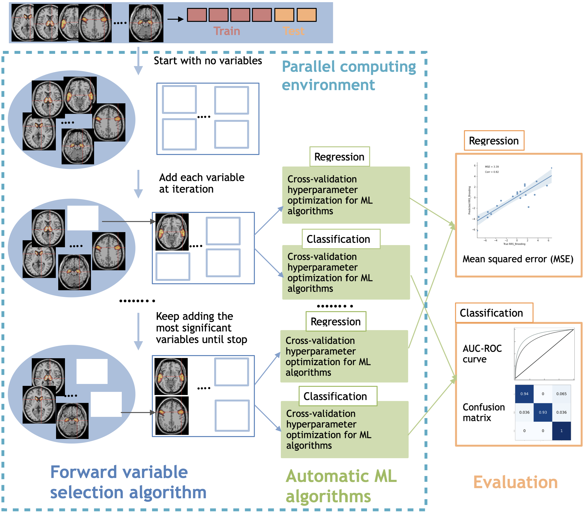
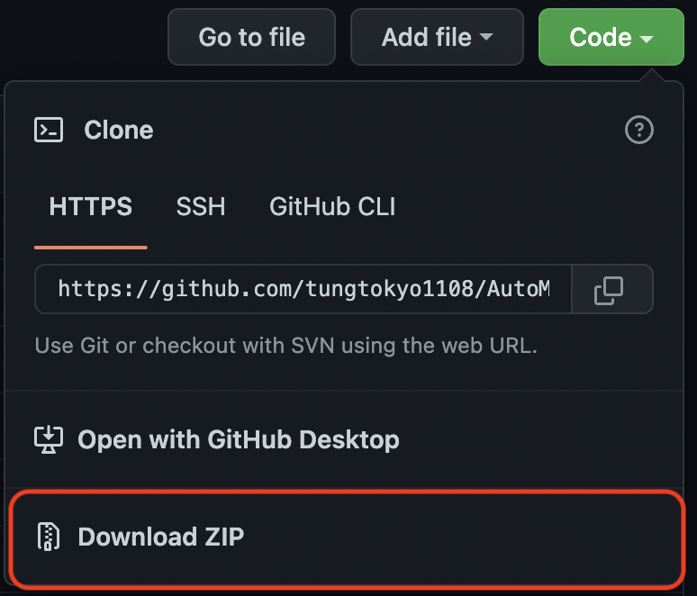
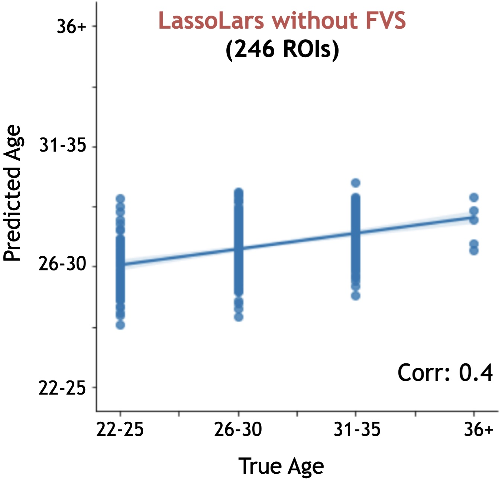
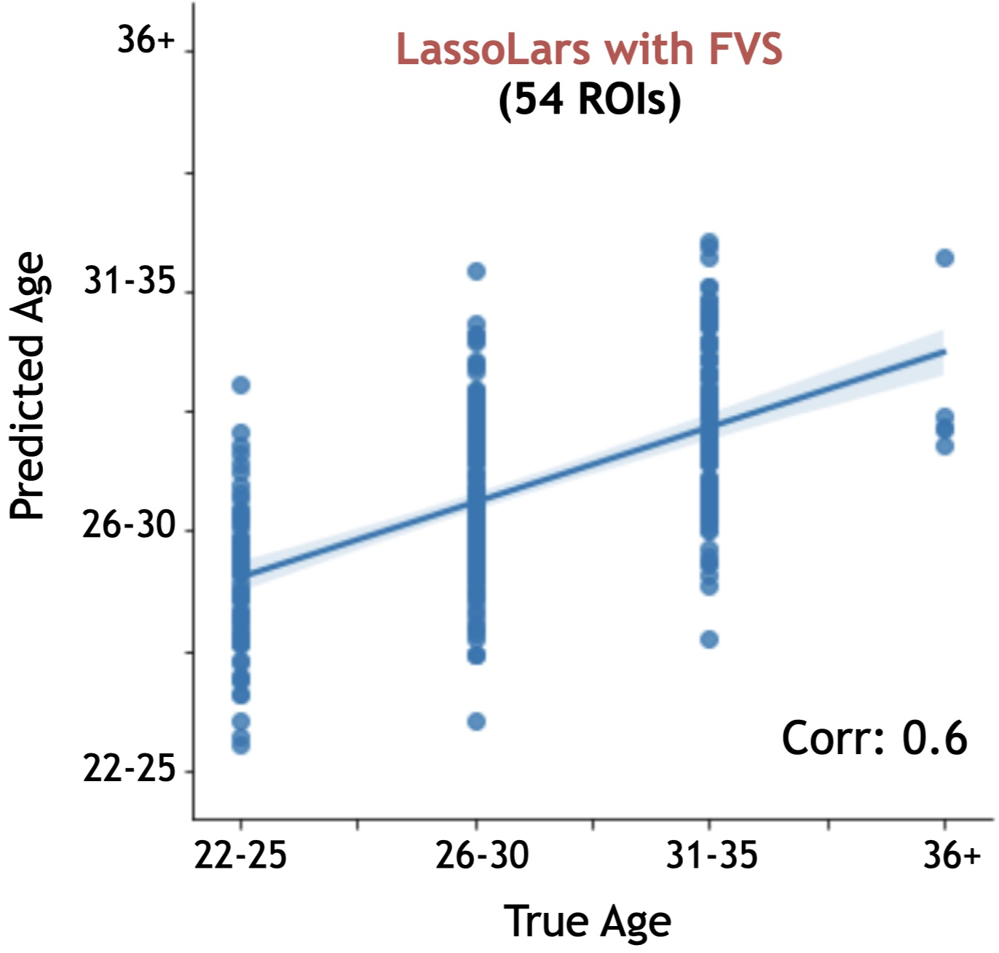
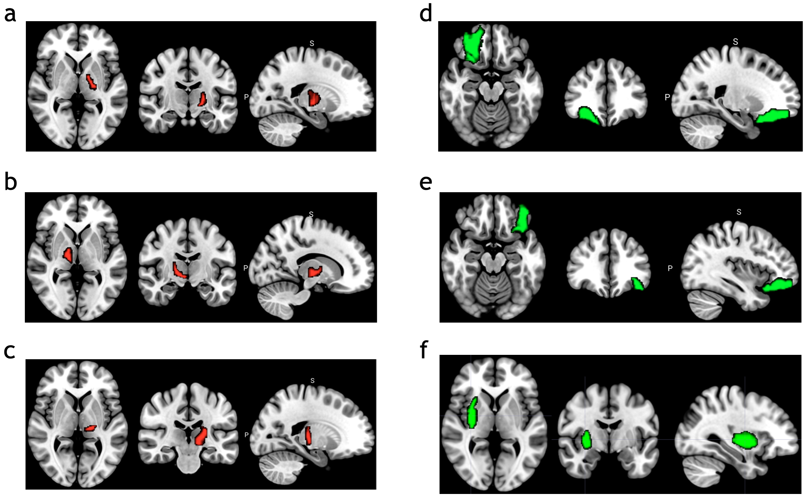
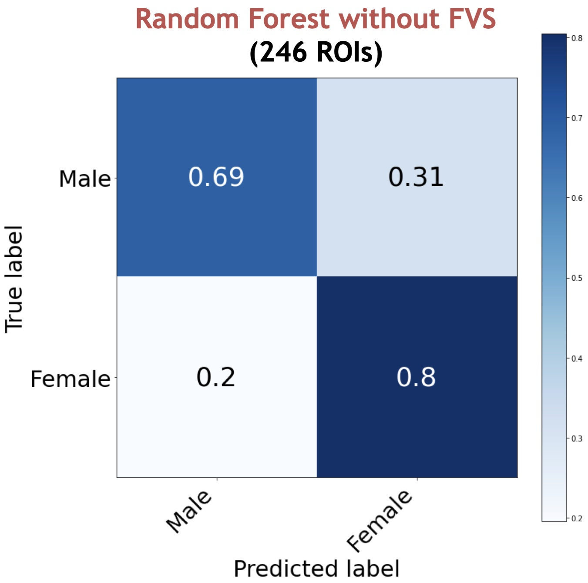
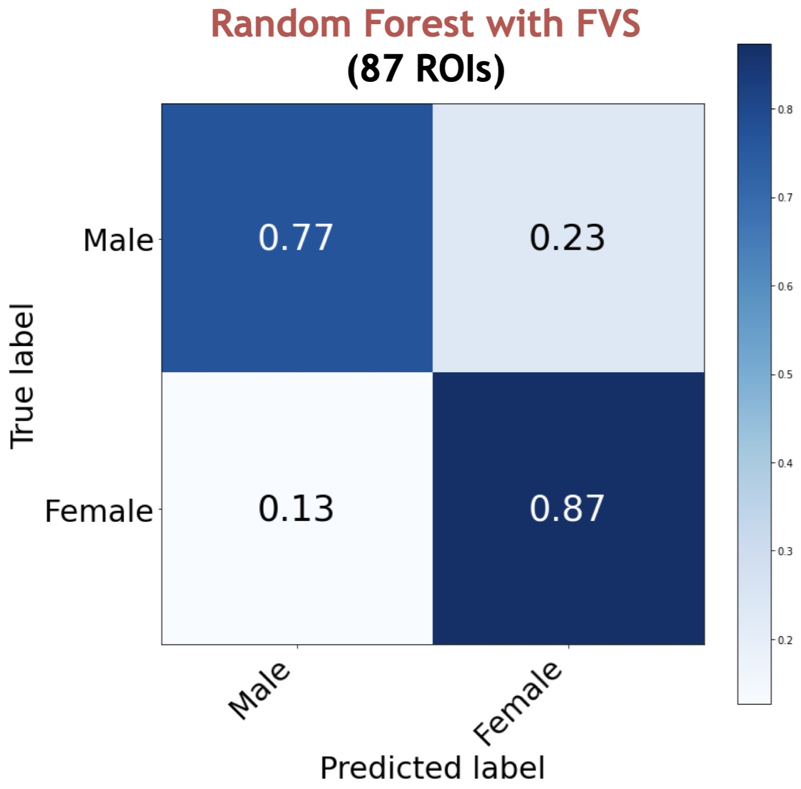
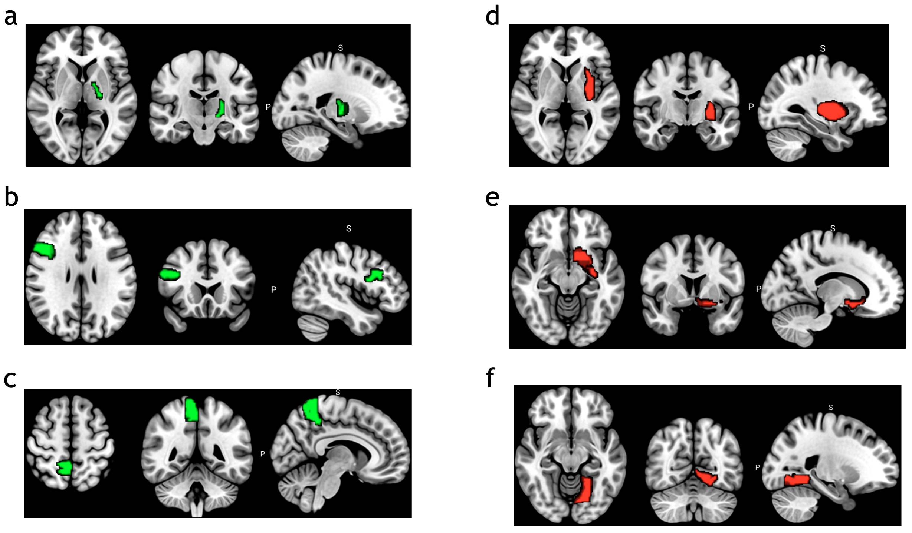

# AutoML_FVS: A new approach to identify a important group of brain region from fMRI databases 

## The workflow of the algorithm



## Main commands and options

### Install step 
1 - Download and unzip package  


2 - In Spyder, change "working directory" to unzip package 


### 1. Automatic machine learning approaches 

First of all, we import some packages that are necessary to analyze the database 

```
import argparse
import pandas as pd
import numpy as np
import matplotlib.pyplot as plt
import seaborn as sns
from tqdm import tqdm
import time
from sklearn.model_selection import train_test_split
import warnings 
warnings.simplefilter("ignore")
```

Our package includes 4 main functions:

1 - AutoML_classification: includes 11 ML regression algorithms for automatic process 

2 - AutoML_Regression: includes 9 ML classification algorithms for automatic process 

3 - AutoML_FVS_Regression: combines forward variable selection (FVS) with 11 ML regression algorithms

4 - AutoML_FVS_Classification: combines forward variable selection (FVS) with 9 ML classification algorithms

```
from Auto_ML_Multiclass import AutoML_classification
from Auto_ML_Regression import AutoML_Regression
from FVS_Regression import AutoML_FVS_Regression
from FVS_Classification import AutoML_FVS_Classification

```

### 1.1 Regression

Import data 

```
bna = pd.read_csv("ROI_test.csv", index_col="BNAsubjID")
meta = pd.read_csv("Meta_test.csv", index_col="Subject")
y = meta["AgeTag"]
```

We separate the input data: 70% for training procress and 30% for testing process 

- X_train, X_test: fMRI dataset has 246 brain regions 

- y_train, y_test: Target relative to X for regression

```
X_train, X_test, y_train, y_test = train_test_split(bna, y, test_size=0.3, random_state=42)
```

We run automatic machine learning algorithm for regression
|      |AutoML_Regression.fit(X_train, y_train, X_test, y_test)|
|------|--------------------------- |
| Parameters | X_train, y_train: input data for training process|
|            | X_test, y_test: input data for testing process   |
```
automl = AutoML_Regression()
result = automl.fit(X_train, y_train, X_test, y_test)
```
Outputs are shown in table 

| Rank |Name_Model                  | MSE       | MAE      | R2_Score |
|------|--------------------------- |:---------:|:--------:|:--------:|
|   1  |LassoLars_regression        | 0.547196  | 0.454167 | 0.201219 |
|   2  |MultiTaskLasso_regression   | 0.558322  | 0.468323 | 0.194563 |
|   3  |GaussianProcess_regression  | 0.566105  | 0.485591 | 0.145952 |
|   4  |Ridge_regression            | 0.567103  | 0.490016 | 0.138169 |
|   5  |ElasticNet_regression       | 0.567914  | 0.490908 | 0.136645 |
|   6  |Random_Forest               | 0.572277  | 0.480769 | 0.154432 |
|   7  |Lars_regression             | 0.578837  | 0.498872 | 0.122593 |
|   8  |LASSO_regression            | 0.582059  | 0.503492 | 0.114467 |
|   9  |KernelRidge_regression      | 0.583765  | 0.516645 | 0.091333 |
|  10  |DecisionTree_regression     | 0.611971  | 0.566921 | 0.002910 |
|  11  |Stochastic_Gradient_Descent | 0.613786  | 0.568636 | -0.00010 |

### 1.2 Classification

Import data and label groups for classification 

```
bna = pd.read_csv("ROI_catROI_bna_Vgm.csv", index_col="BNAsubjID")
meta = pd.read_csv("NEOFFI.csv", index_col="Subject")
y = meta["Gender"].apply(lambda x: 0 
                             if x == "M" else 1)
class_name = ["Male", "Female"]
```

We separate the input data: 70% for training procress and 30% for testing process 
```
X_train, X_test, y_train, y_test = train_test_split(bna, y, test_size=0.3, random_state=42)
```

We run automatic machine learning algorithm for classification
```
automl = AutoML_classification()
result = automl.fit(X_train, y_train, X_test, y_test)
```
Outputs are shown in table 

| Rank | Name_Model                  | Accuracy (%)| Precision | Recall   | F1_Score |
| -----|---------------------------- |:-----------:|:---------:|:--------:|:--------:|
|   1  | Random_Forest               | 61.842105   | 0.6103    | 0.5923   | 0.5869   |
|   2  | Extreme_Gradient_Boosting   | 60.115261   | 0.5903    | 0.5822   | 0.5614   |
|   3  | Support_Vector_Machine      | 59.210526   | 0.5783    | 0.5655   | 0.5584   |
|   4  | Gradient_Boosting           | 58.320126   | 0.5615    | 0.5691   | 0.5649   |
|   5  | Losgistic_Classification    | 56.578947   | 0.5535    | 0.5571   | 0.5579   |
|   6  | Naive_Bayes                 | 55.294832   | 0.5492    | 0.5387   | 0.5426   |
|   7  | Stochastic_Gradient_Descent | 52.631579   | 0.5213    | 0.5215   | 0.5210   |
|   8  | Decision_Tree               | 49.543053   | 0.4815    | 0.4943   | 0.4834   |
|   9  | Extra_Tree                  | 43.421053   | 0.4265    | 0.4260   | 0.4262   |


### 2. Forward Variable Selection algorithm - FVS
### 2.1 Regression

After selecting the best algorithm for analyzing our database, we go to the next step that run forward variable selection to identify a important group of brain regions. For example, in our database, the LassoLars regression is the best model with the smallest value of MSE. Thus, we start with combination of the LassoLars regression and forward variable selection. 

```
from FVS_algorithm import AutoML_FVS
fvs = AutoML_FVS()
all_info, all_model, f = fvs.LassoLars_FVS(X_train, y_train, X_test, y_test, n_selected_features = 200)

[Parallel(n_jobs=-1)]: Using backend LokyBackend with 80 concurrent workers.
[Parallel(n_jobs=-1)]: Done  40 tasks      | elapsed:   38.9s
[Parallel(n_jobs=-1)]: Done 246 out of 246 | elapsed:  2.4min finished
The current number of features: 1 - MSE: 0.61

[Parallel(n_jobs=-1)]: Using backend LokyBackend with 80 concurrent workers.
[Parallel(n_jobs=-1)]: Done  40 tasks      | elapsed:   36.9s
[Parallel(n_jobs=-1)]: Done 246 out of 246 | elapsed:  2.4min finished
The current number of features: 2 - MSE: 0.60

[Parallel(n_jobs=-1)]: Using backend LokyBackend with 80 concurrent workers.
[Parallel(n_jobs=-1)]: Done  40 tasks      | elapsed:   41.4s
[Parallel(n_jobs=-1)]: Done 246 out of 246 | elapsed:  2.5min finished
The current number of features: 3 - MSE: 0.59

.....

```

### 2.2 Classification

After selecting the best algorithm for analyzing our database, we go to the next step that run forward variable selection to identify a important group of brain regions. For example, in our database, the decision tree classifier is the best model with the highest accuracy. Thus, we start with combination of the decision tree classifier and random forest classifier and forward variable selection. 

#### Random forest classifier

```
all_info, all_model, f = fvs.RandomForest_FVS(X_train, y_train, X_test, y_test, n_selected_features = 200)

[Parallel(n_jobs=-1)]: Using backend LokyBackend with 80 concurrent workers.
[Parallel(n_jobs=-1)]: Done  40 tasks      | elapsed:    0.2s
[Parallel(n_jobs=-1)]: Done 246 out of 246 | elapsed:  1.1min finished
The current number of features: 1 - Accuracy: 67.11%

.....

[Parallel(n_jobs=-1)]: Using backend LokyBackend with 80 concurrent workers.
[Parallel(n_jobs=-1)]: Done  40 tasks      | elapsed:    0.5s
[Parallel(n_jobs=-1)]: Done 246 out of 246 | elapsed:  1.1min finished
The current number of features: 10 - Accuracy: 70.26%

.....

[Parallel(n_jobs=-1)]: Using backend LokyBackend with 80 concurrent workers.
[Parallel(n_jobs=-1)]: Done  40 tasks      | elapsed:    0.2s
[Parallel(n_jobs=-1)]: Done 246 out of 246 | elapsed:   27.2s finished
The current number of features: 87 - Accuracy: 82.63%

.....

```

Outputs of forward variable selection are shown in table

| Number of selected features | Accuracy    | Name of selected feature                                                |
| --------------------------- |:-----------:|:-----------------------------------------------------------------------:|
| 87                          | 0.8263      | BNA167lINSdIa, BNA228rBGdCdN, BNA185lCingA23c, BNA216rHipprHipp,...     |
| 73                          | 0.7894.     | BNA167lINSdIa, BNA228rBGdCdN, BNA185lCingA23c, BNA216rHipprHipp,...     |
| ...                         | ...         | ...                                                                     |
| 60                          | 0.776316    | BNA167lINSdIa, BNA228rBGdCdN, BNA185lCingA23c, BNA216rHipprHipp,...     |
| 8                           | 0.763158    | BNA167lINSdIa, BNA228rBGdCdN, BNA185lCingA23c, BNA216rHipprHipp,...     |
| ...                         | ...         | ...                                                                     |
| 3                           | 0.710526    | BNA229lBGdlPUT, BNA167lINSdIa, BNA228rBGdCdN                            |
| ...                         | ...         | ...                                                                     |
| 154                         | 0.697368    | BNA167lINSdIa, BNA228rBGdCdN, BNA185lCingA23c, BNA216rHipprHipp,...     |
| ...                         | ...         | ...                                                                     |


### 3. Evaluate the performances
### 3.1. Regression 

```
fvs = AutoML_FVS()
evaluate_LassoLars = fvs.evaluate_regression(selected_LassoLars_model, data_full, data_selected, model = 'LassoLars')
```

| LassoLar for 246 brain regions | LassoLar for 54 selected brain regions by FVS | 
| ----------------------------------- |:---------------------------------------------:|
| |   | 


Mapped selected region on brain (http://atlas.brainnetome.org/bnatlas.html) 
 


### 3.2. Classification

#### Random forest classifier
We evaluate the random forest model with 87 brain regions that seletected by forward variable selection. 

```
fvs = AutoML_FVS()
evaluate_ramdomforest = fvs.evaluate_multiclass(selected_randomforest_model, data_full, data_selected, 
                            model = 'Random Forest', num_class=2, class_name = class_name))
                                  
Classification report for Random Forest model: 

              precision    recall  f1-score   support

     MDD-BPD       0.85      0.67      0.75        33
      Health       0.78      0.91      0.84        43

    accuracy                           0.80        76
   macro avg       0.81      0.79      0.79        76
weighted avg       0.81      0.80      0.80        76

```
* The precision of health was 0.85, in other words, when RF predicts that a individual is health control, it is averagely correct 85% of the time. 
* The recall of health control was 0.67, in other words, RF correctly identifies 67% of all health control.
* The precision of MDD-BPD case was 0.75, in other words, when RF predicts that a individual is MDD-BPD case, it is averagely correct 75% of the time. 
* The recall of MDD-BPD case was 0.84, in other words, RF correctly identifies 84% of MDD-BPD cases.

| Random forest for 246 brain regions | Random forest for 87 selected brain regions by FVS | 
| ----------------------------------- |:---------------------------------------------:|
| |   | 

Mapped selected region on brain (http://atlas.brainnetome.org/bnatlas.html) 
 


