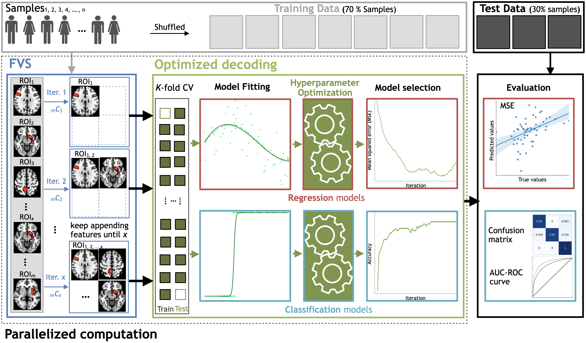
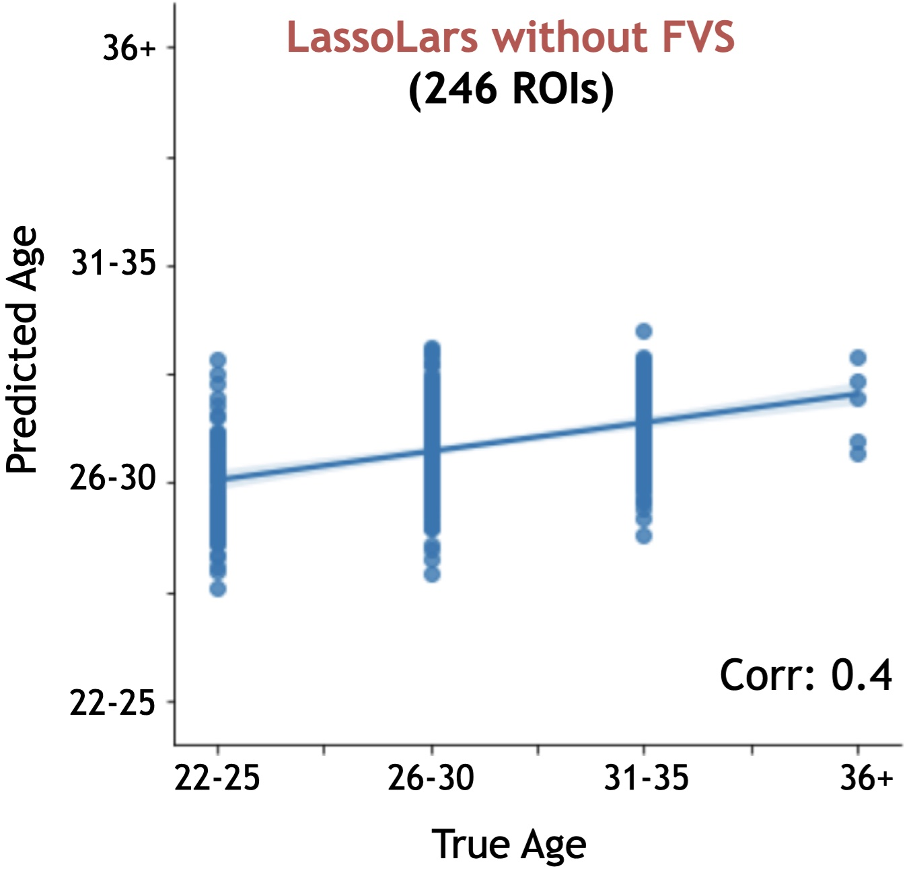
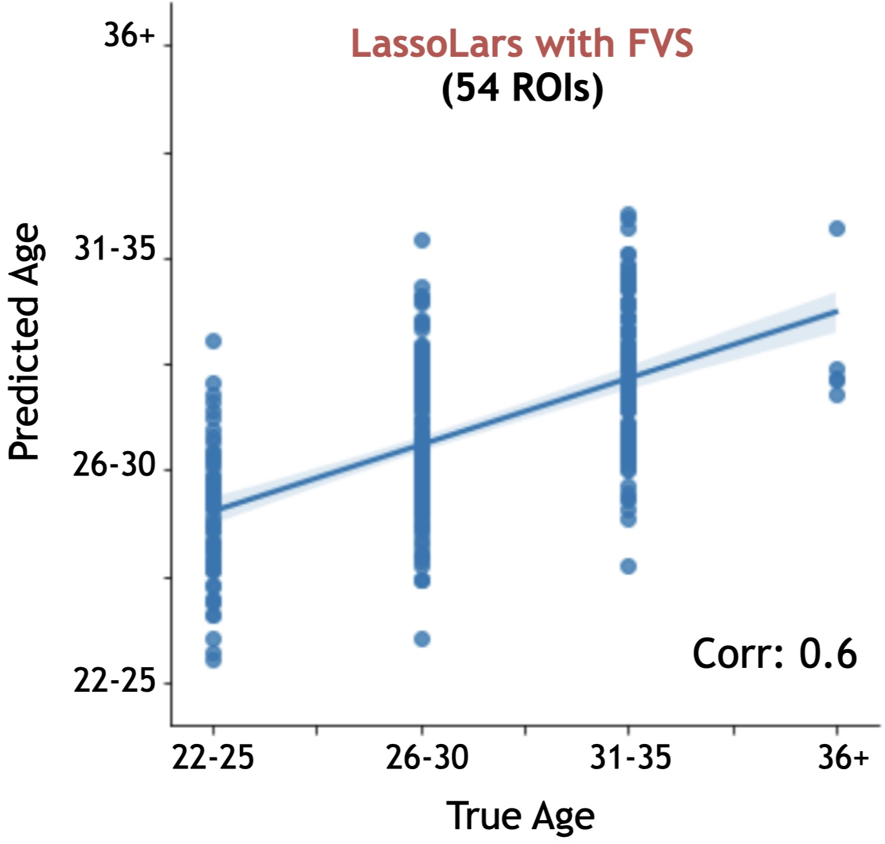
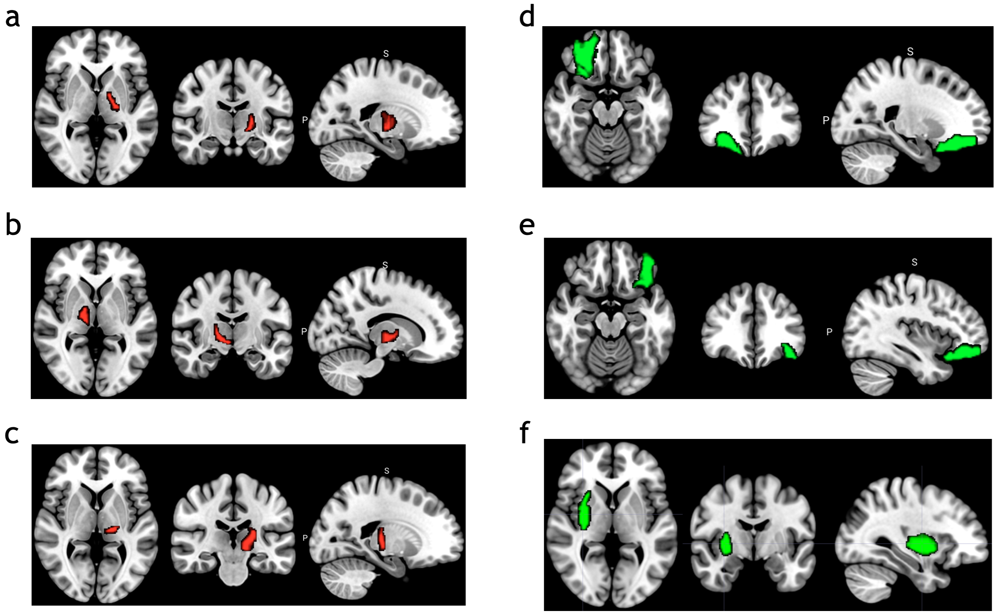
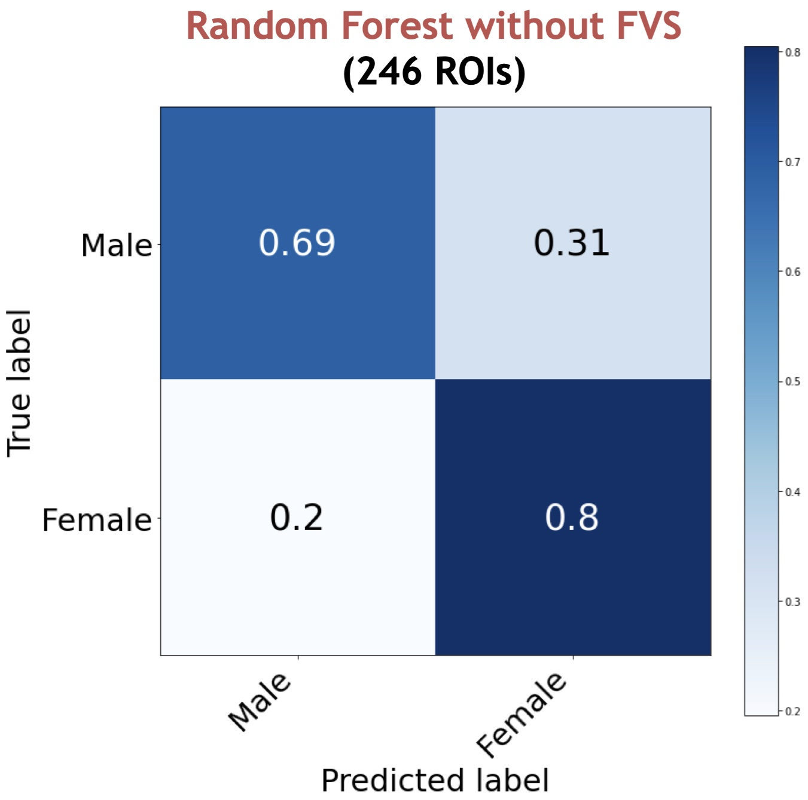
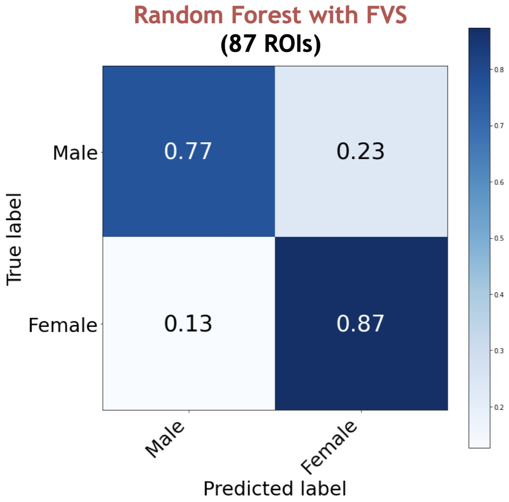
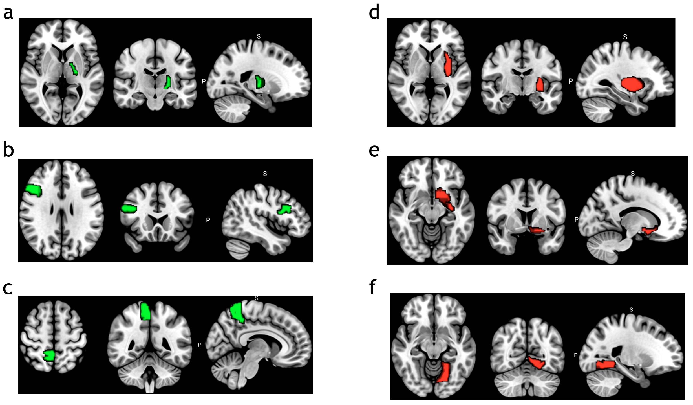

# AutoML_FVS: A new approach to identify a important group of brain region from fMRI databases 

## The workflow of the algorithm



## Main commands and options

### Install step 
1 - Download and unzip package  


2 - In Spyder, change "working directory" to unzip package 


### 1. Automatic machine learning approaches 

First of all, we import some packages that are necessary to analyze the database 

```
import argparse
import pandas as pd
import numpy as np
import matplotlib.pyplot as plt
import seaborn as sns
from tqdm import tqdm
import time
from sklearn.model_selection import train_test_split
import warnings 
warnings.simplefilter("ignore")
```

Our package includes 4 main functions:

1 - AutoML_classification: includes 11 ML regression algorithms for automatic process 

2 - AutoML_Regression: includes 9 ML classification algorithms for automatic process 

3 - AutoML_FVS_Regression: combines forward variable selection (FVS) with 11 ML regression algorithms

4 - AutoML_FVS_Classification: combines forward variable selection (FVS) with 9 ML classification algorithms

```
from Auto_ML_Multiclass import AutoML_classification
from Auto_ML_Regression import AutoML_Regression
from FVS_Regression import AutoML_FVS_Regression
from FVS_Classification import AutoML_FVS_Classification

```

### 1.1 Regression

Import data 

```
bna = pd.read_csv("ROI_test.csv", index_col="BNAsubjID")
meta = pd.read_csv("Meta_test.csv", index_col="Subject")
y = meta["AgeTag"]
```

We separate the input data: 70% for training procress and 30% for testing process 

- X_train, X_test: fMRI dataset has 246 brain regions 

- y_train, y_test: Target relative to X for regression

```
X_train, X_test, y_train, y_test = train_test_split(bna, y, test_size=0.3, random_state=42)
```

We run automatic machine learning algorithm for regression

|      |AutoML_Regression.fit(X_train, y_train, X_test, y_test)|
|------|--------------------------- |
| Parameters | X_train, y_train: input data for training process|
|            | X_test, y_test: input data for testing process   |
| Returns    | a table: rank of performances of 11 ML regresion |

```
automl = AutoML_Regression()
result = automl.fit(X_train, y_train, X_test, y_test)
```

Outputs are shown in table 

| Rank |Name_Model                  | MSE       | MAE      | R2_Score |
|------|--------------------------- |:---------:|:--------:|:--------:|
|   1  |LassoLars_regression        | 0.547196  | 0.454167 | 0.201219 |
|   2  |MultiTaskLasso_regression   | 0.558322  | 0.468323 | 0.194563 |
|   3  |GaussianProcess_regression  | 0.566105  | 0.485591 | 0.145952 |
|   4  |Ridge_regression            | 0.567103  | 0.490016 | 0.138169 |
|   5  |ElasticNet_regression       | 0.567914  | 0.490908 | 0.136645 |
|   6  |Random_Forest               | 0.572277  | 0.480769 | 0.154432 |
|   7  |Lars_regression             | 0.578837  | 0.498872 | 0.122593 |
|   8  |LASSO_regression            | 0.582059  | 0.503492 | 0.114467 |
|   9  |KernelRidge_regression      | 0.583765  | 0.516645 | 0.091333 |
|  10  |DecisionTree_regression     | 0.611971  | 0.566921 | 0.002910 |
|  11  |Stochastic_Gradient_Descent | 0.613786  | 0.568636 | -0.00010 |

We run a function to show the performance of ML algorithm.

|      |AutoML_Regression.evaluate_regression(best_clf, X_train, y_train, X_test, y_test, model="Random Forest", name_target = "agetag", feature_evaluate = True, top_features=2)|
|------|--------------------------- |
| Parameters | best_clf: a selected ML algorithm|
|            | X_train, y_train: input data for training process|
|            | X_test, y_test: input data for testing process   |
|            | model: name of ML algorithm                      |
|            | name_target: name of target variable             |
|            | feature_evaluate: show plot of permutation feature importance            |
|            | top_features: show plot of feature importance of Random Forest           |
| Returns    | a table: MSE and spearman correlation |
|            | plots: feature importance |

```
LL_best, _, _, _ = automl.LassoLars_regression(X_train, y_train, X_test, y_test)
evaluate = automl.evaluate_regression(LL_best, X_train, y_train, X_test, y_test, model="LassoLars regression",
                                        name_target = "AgeTag", feature_evaluate = True)
                                        
~~~~~~~~~~~~~~~~~~ PERFORMANCE EVALUATION ~~~~~~~~~~~~~~~~~~~~~~~~

Detailed report for the LassoLars regression algorithm

Mean_Squared_Error of the LassoLars regression model is 0.5603

Spearman correlation of the LassoLars regression model is 0.1758 with p-value 0.0012587919926902718

```

### 1.2 Classification

Import data and label groups for classification 

```
bna = pd.read_csv("ROI_test.csv", index_col="BNAsubjID")
meta = pd.read_csv("Meta_test.csv", index_col="Subject")
y = meta["Gender"].apply(lambda x: 0 if x == "M" else 1)
class_name = ["Male", "Female"]
```

We separate the input data: 70% for training procress and 30% for testing process 

```
X_train, X_test, y_train, y_test = train_test_split(bna, y, test_size=0.3, random_state=42)
```

We run automatic machine learning algorithm for classification

|      |AutoML_classification.fit(X_train, y_train, X_test, y_test)|
|------|--------------------------- |
| Parameters | X_train, y_train: input data for training process.   |
|            | X_test, y_test: input data for testing process       |
| Returns    | a table: rank of performances of 9 ML classification |

```
automl = AutoML_classification()
result = automl.fit(X_train, y_train, X_test, y_test)
```

Outputs are shown in table 

| Rank | Name_Model                  | Accuracy (%)| Precision | Recall   | F1_Score |
| -----|---------------------------- |:-----------:|:---------:|:--------:|:--------:|
|   1  | Random_Forest               | 61.842105   | 0.6103    | 0.5923   | 0.5869   |
|   2  | Extreme_Gradient_Boosting   | 60.115261   | 0.5903    | 0.5822   | 0.5614   |
|   3  | Support_Vector_Machine      | 59.210526   | 0.5783    | 0.5655   | 0.5584   |
|   4  | Gradient_Boosting           | 58.320126   | 0.5615    | 0.5691   | 0.5649   |
|   5  | Losgistic_Classification    | 56.578947   | 0.5535    | 0.5571   | 0.5579   |
|   6  | Naive_Bayes                 | 55.294832   | 0.5492    | 0.5387   | 0.5426   |
|   7  | Stochastic_Gradient_Descent | 52.631579   | 0.5213    | 0.5215   | 0.5210   |
|   8  | Decision_Tree               | 49.543053   | 0.4815    | 0.4943   | 0.4834   |
|   9  | Extra_Tree                  | 43.421053   | 0.4265    | 0.4260   | 0.4262   |

We run a function to show the performance of ML algorithm.

|      |AutoML_classification.evaluate_multiclass(self, best_clf, X_train, y_train, X_test, y_test, model="Random Forest", num_class=3, top_features=2, class_name = "")|
|------|--------------------------- |
| Parameters | best_clf: a selected ML algorithm|
|            | X_train, y_train: input data for training process|
|            | X_test, y_test: input data for testing process   |
|            | model: name of ML algorithm                      |
|            | num_class: number of classes for classification             |
|            | class_name: names of classes            |
|            | top_features: show plot of feature importance of Random Forest           |
| Returns    | a dictionary: accuracy, precision, recall and F1 score |
|            | plots: confusion matrix, AUC and feature importance |

```
rf_best, _, _, _, _ = automl.Random_Forest(X_train, y_train, X_test, y_test)
evaluate_rf = automl.evaluate_multiclass(rf_best, X_train, y_train, X_test, y_test,
                            model = "Random_Forest", num_class=2, class_name = class_name)
                                        
~~~~~~~~~~~~~~~~~~ PERFORMANCE EVALUATION ~~~~~~~~~~~~~~~~~~~~~~~~

Detailed report for the Random_Forest algorithm
The number of accurate predictions out of 334 data points on unseen data is 253
Accuracy of the Random_Forest model on unseen data is 75.75
Precision of the Random_Forest model on unseen data is 0.7532
Recall of the Random_Forest model on unseen data is 0.7528
F1 score of the Random_Forest model on unseen data is 0.753

Classification report for Random_Forest model: 

              precision    recall  f1-score   support

           0       0.72      0.72      0.72       145
           1       0.78      0.79      0.79       189

    accuracy                           0.76       334
   macro avg       0.75      0.75      0.75       334
weighted avg       0.76      0.76      0.76       334


The Confusion Matrix: 

[[104  41]
 [ 40 149]]

```

### 2. Forward Variable Selection algorithm - FVS
### 2.1 Regression

After selecting the best algorithm for analyzing our database, we go to the next step that run forward variable selection to identify a important group of brain regions. For example, in our database, the LassoLars regression is the best model with the smallest value of MSE. Thus, we start with combination of the LassoLars regression and forward variable selection. 

|      |AutoML_FVS_Regression.fit(X_train, y_train, X_test, y_test, model = "LassoLars", n_selected_features = 10)|
|------|--------------------------- |
| Parameters | X_train, y_train: input data for training process.   |
|            | X_test, y_test: input data for testing process       |
|            | model: name of models with combining with FVS. Please select one of them: LassoLars, KernelRidge, Random_Forest, Stochastic_Gradient_Descent, DecisionTree, ElasticNet, Ridge, Lasso, GaussianProcess     |
|            | n_selected_features: number of features that is wanted to select       |
| Returns    | all_infor: rank of performances of ML algorithm for number of features |
|            | all_model: a model responses a number of features |
|            | f: all of selected features |

```
fvs = AutoML_FVS_Regression()
all_info, all_model, f = fvs.fit(X_train, y_train, X_test, y_test, model = "LassoLars", n_selected_features = 10)

~~~~~~~~~~~~~~~~~~ STARTING ALGORITHM ~~~~~~~~~~~~~~~~~~~~~~~~

Forward variable selection combined with the LassoLars algorithm

[Parallel(n_jobs=-1)]: Using backend LokyBackend with 80 concurrent workers.
[Parallel(n_jobs=-1)]: Done  40 tasks      | elapsed:   38.9s
[Parallel(n_jobs=-1)]: Done 246 out of 246 | elapsed:  2.4min finished
The current number of features: 1 - MSE: 0.54 - Corr: 0.21

[Parallel(n_jobs=-1)]: Using backend LokyBackend with 80 concurrent workers.
[Parallel(n_jobs=-1)]: Done  40 tasks      | elapsed:   36.9s
[Parallel(n_jobs=-1)]: Done 246 out of 246 | elapsed:  2.4min finished
The current number of features: 2 - MSE: 0.54 - Corr: 0.25

[Parallel(n_jobs=-1)]: Using backend LokyBackend with 80 concurrent workers.
[Parallel(n_jobs=-1)]: Done  40 tasks      | elapsed:   41.4s
[Parallel(n_jobs=-1)]: Done 246 out of 246 | elapsed:  2.5min finished
The current number of features: 3 - MSE: 0.53 - Corr: 0.26

.....

```

### 2.2 Classification

After selecting the best algorithm for analyzing our database, we go to the next step that run forward variable selection to identify a important group of brain regions. For example, in our database, the decision tree classifier is the best model with the highest accuracy. Thus, we start with combination of the decision tree classifier and random forest classifier and forward variable selection. 

|      |AutoML_FVS_Classification.fit(X_train, y_train, X_test, y_test, model = "LassoLars", n_selected_features = 10)|
|------|--------------------------- |
| Parameters | X_train, y_train: input data for training process.   |
|            | X_test, y_test: input data for testing process       |
|            | model: name of models with combining with FVS. Please select one of them: Random_Forest, Stochastic_Gradient_Descent, DecisionTree, Logistic, Naive_Bayes, Gradient_Boosting, Support_Vector_Classify     |
|            | n_selected_features: number of features that is wanted to select       |
| Returns    | all_infor: rank of performances of ML algorithm for number of features |
|            | all_model: a model responses a number of features |
|            | f: all of selected features |

```
fvs = AutoML_FVS_Classification()
all_info, all_model, f = fvs.fit(X_train, y_train, X_test, y_test, model = "Logistic", n_selected_features = 100)

[Parallel(n_jobs=-1)]: Using backend LokyBackend with 80 concurrent workers.
[Parallel(n_jobs=-1)]: Done  40 tasks      | elapsed:    0.2s
[Parallel(n_jobs=-1)]: Done 246 out of 246 | elapsed:  1.1min finished
The current number of features: 1 - Accuracy: 67.11%

.....

[Parallel(n_jobs=-1)]: Using backend LokyBackend with 80 concurrent workers.
[Parallel(n_jobs=-1)]: Done  40 tasks      | elapsed:    0.5s
[Parallel(n_jobs=-1)]: Done 246 out of 246 | elapsed:  1.1min finished
The current number of features: 10 - Accuracy: 70.26%

```

Outputs of forward variable selection are shown in table

| Number of selected features | Accuracy    | Name of selected feature                                                |
| --------------------------- |:-----------:|:-----------------------------------------------------------------------:|
| 87                          | 0.8263      | BNA167lINSdIa, BNA228rBGdCdN, BNA185lCingA23c, BNA216rHipprHipp,...     |
| 73                          | 0.7894.     | BNA167lINSdIa, BNA228rBGdCdN, BNA185lCingA23c, BNA216rHipprHipp,...     |
| ...                         | ...         | ...                                                                     |
| 60                          | 0.776316    | BNA167lINSdIa, BNA228rBGdCdN, BNA185lCingA23c, BNA216rHipprHipp,...     |
| 8                           | 0.763158    | BNA167lINSdIa, BNA228rBGdCdN, BNA185lCingA23c, BNA216rHipprHipp,...     |
| ...                         | ...         | ...                                                                     |
| 3                           | 0.710526    | BNA229lBGdlPUT, BNA167lINSdIa, BNA228rBGdCdN                            |
| ...                         | ...         | ...                                                                     |
| 154                         | 0.697368    | BNA167lINSdIa, BNA228rBGdCdN, BNA185lCingA23c, BNA216rHipprHipp,...     |
| ...                         | ...         | ...                                                                     |


### 3. Evaluate the performances
### 3.1. Regression 

```
subset = f
subset = subset.drop(columns = "All")
load_grid_model = all_model

best_model_6 = load_grid_model[6]
subset = subset.iloc[6].dropna()
region_subset = bna[subset]

X_train, X_test, y_train, y_test = train_test_split(region_subset, y, test_size=0.3, random_state=42)

best_model_6.fit(X_train, y_train)
evaluate_r = automl.evaluate_regression(best_model_6, X_train, y_train, X_test, y_test, model="Ridge regression",
                                        name_target = "AgeTag", feature_evaluate = True)
```

| LassoLar for 246 brain regions | LassoLar for 54 selected brain regions by FVS | 
| ----------------------------------- |:---------------------------------------------:|
| || 


Mapped selected region on brain (http://atlas.brainnetome.org/bnatlas.html) 



### 3.2. Classification

#### Random forest classifier
We evaluate the random forest model with 8 brain regions that seletected by forward variable selection. 

```
subset = f
subset = subset.drop(columns = "All")
load_grid_model = all_model

best_model_8 = load_grid_model[8]
subset = subset.iloc[8].dropna()
region_subset = bna[subset]

X_train, X_test, y_train, y_test = train_test_split(region_subset, y, test_size=0.3, random_state=42)

best_model_8.fit(X_train, y_train)
evaluate_logistic = automl.evaluate_multiclass(best_model_8, X_train, y_train, X_test, y_test,
                            model = "Random_Forest", num_class=2, class_name = class_name)
                                  
Classification report for Random Forest model: 

              precision    recall  f1-score   support

     MDD-BPD       0.85      0.67      0.75        33
      Health       0.78      0.91      0.84        43

    accuracy                           0.80        76
   macro avg       0.81      0.79      0.79        76
weighted avg       0.81      0.80      0.80        76

```
* The precision of health was 0.85, in other words, when RF predicts that a individual is health control, it is averagely correct 85% of the time. 
* The recall of health control was 0.67, in other words, RF correctly identifies 67% of all health control.
* The precision of MDD-BPD case was 0.75, in other words, when RF predicts that a individual is MDD-BPD case, it is averagely correct 75% of the time. 
* The recall of MDD-BPD case was 0.84, in other words, RF correctly identifies 84% of MDD-BPD cases.

| Random forest for 246 brain regions | Random forest for 87 selected brain regions by FVS | 
| ----------------------------------- |:---------------------------------------------:|
| || 

Mapped selected region on brain (http://atlas.brainnetome.org/bnatlas.html) 



